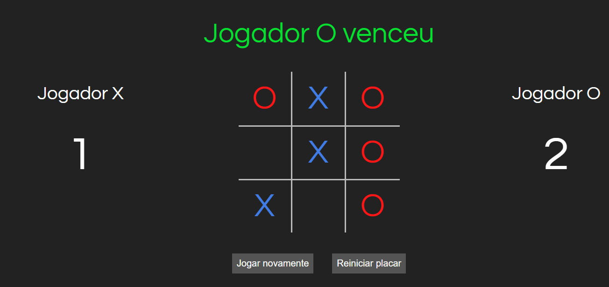
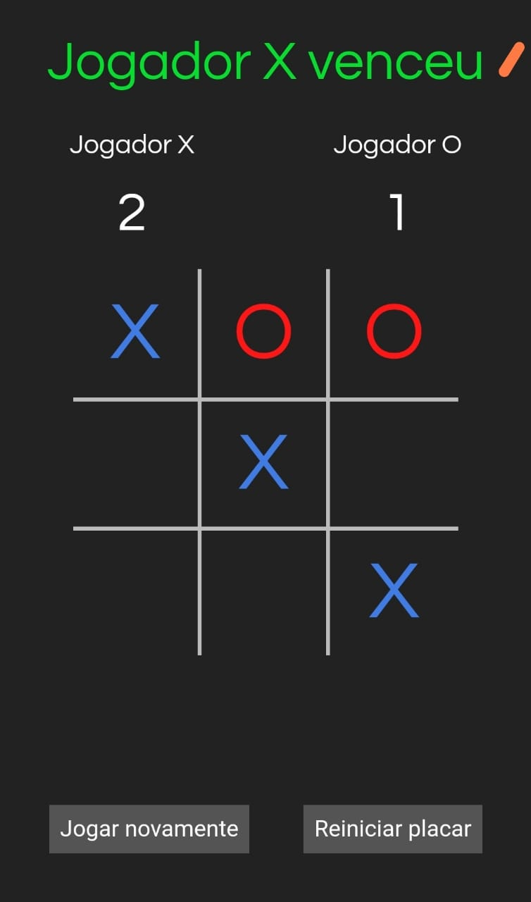

# Jogo da Velha

Acesse o projeto <a href="https://jonathanrianelli.github.io/jogo-da-velha/">aqui</a>

## Descrição

Jogo da velha com placar, feito em React com Typescript e styled-components

## Tecnologias Usadas
- ✔️ React
- ✔️ Styled-Components
- ✔️ HTML
- ✔️ TypeScript

## Layout 
### Desktop:

### Mobile:
